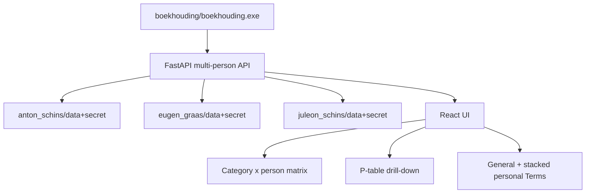

# Boekhouding — multi-person administration

Admin app for several personal bookkeeping packs. It shows a category × person
totals matrix, drill-down P-tables (with the same right-click term UI as the
personal app), stacked Terms (general + one personal table per person), and a
Refresh that fetches all banks **without** consent renewal.

Source lives in **`boekh-multiperson/`**. The runnable admin exe and all person
packs live in the nested **`boekhouding/`** folder.

This is a fork of `single-docker`. It does **not** use `bankingApp-server` or the
`psd2-api collect` pipeline (unlike `boekh-admin`).

---

## Deploy / runtime layout

```
boekh-multiperson/                 # this project (source)
  app/  frontend/  scripts/ …
  README.md
  boekhouding/                     # deploy folder (exe + person packs)
    boekhouding.exe                # admin onefile — place/build here
    anton_schins/
      boekh.exe                    # optional personal app
      data/
      secret/
    eugen_graas/
      data/
      secret/
    juleon_schins/
      boekh.exe
      data/
      secret/
```

- **Frozen `app_root`** = folder that contains `boekhouding.exe` → always
  `…/boekhouding/`.
- **Dev `app_root`** = `<project>/boekhouding/` (same place; source stays one
  level up).
- Person packs are **sibling folders** of the admin exe.
- A folder is accepted if it has **both** `data/` and `secret/` (plus a readable
  `secret/profile.json` and exactly one `.pem` for full use).
- Person identity comes from `secret/profile.json` (`person` field), **never**
  from the folder name.
- Each personal `boekh.exe` still looks for `data/` + `secret/` next to itself.

Default listen port: **8300** (personal apps use 8200).

---

## Person discovery

Scan immediate children of `app_root()` (`boekhouding/`):

1. Keep a directory if it contains both `data/` and `secret/`.
2. Ignore source/build dirs if they ever appear (`app`, `frontend`, `dist`, …).
3. Column header / API short name = `person` from `secret/profile.json`.
4. Per-person paths:

   | Path | Role |
   |------|------|
   | `secret/profile.json` | person short, Enable Banking profile |
   | `secret/*.pem` | private key (exactly one) |
   | `data/categories.json` | general keywords + typerules + abbreviations |
   | `data/personal_categories.json` | personal keywords |
   | `data/categorized_transactions.json` | transactions + modifications |
   | `data/category_totals.json` | per-category totals |
   | `data/consent.json` | bank consent (read-only for admin refresh) |
   | `data/downloaded_transactions.json` | last raw fetch |

---

## Architecture



Reuse `shared.enable_banking` the same way `single-docker` does. Keep per-person
`boekh.exe` packs untouched.

---

## Backend (vs single-docker)

New module `app/people.py`:

- `list_people() -> list[{short, folder, data_dir, secret_dir, …}]`
- Helpers to resolve paths for a short name

### APIs

| Endpoint | Role |
|----------|------|
| `GET /api/people` | Discovered shorts + folder labels |
| `GET /api/matrix` | Rows = categories; columns = per-person totals |
| `POST /api/recalculate` | Recategorize **every** person; return matrix |
| `POST /api/refresh` | Fetch each person with existing consent (**no** authorize UI). Skip renewal-needed packs with a warning |
| `GET /api/transactions/{short}/{category}` | P-table payload (same shape as single-docker) |
| `PUT /api/transactions/{short}/modification` | Person-scoped modification |
| `GET /api/settings` | `general` + `personal: { short: { category: terms[] } }` |
| `PUT /api/settings/{group}/{category}` | `group=general` or person short |
| `POST /api/settings/add-term` | Body includes `person` / `general` |

**Omit** consent authorize, callback, pending, and any consent banner.

### General categories

Treat `categories.json` as shared. On load, use the first discovered person’s
file as the schema source. On save of general terms, **write the same
`categories.json` into every person folder**. Personal terms stay in each
`personal_categories.json`.

### Refresh fetch

Reuse single-docker fetch logic with paths re-bound per person. Default date
window: rolling / previous-month behaviour **without** renewal-day historical
stretch.

---

## Frontend

1. **Main matrix** — categories × person shorts; cell click → P view.
2. **P view** — `PTable` + right-click term menu (G/P); APIs take `short`.
3. **Terms (`?view=terms`)** — General table, then one personal table per person.
4. **Refresh** — `/api/refresh`; show per-person warnings. No Authorization URL UI.

---

## Packaging

```powershell
cd boekh-multiperson
uv run --group build python scripts/build_onefile.py
```

Builds `boekhouding/boekhouding.exe` next to the person packs.

Dev run (API on 8300, discovers packs under `boekhouding/`):

```powershell
uv run boekhouding
# or
uv run python -m app.main
```

---

## Implementation steps

1. Fork scaffold from `single-docker` into `boekh-multiperson/` — done.
2. People discovery under `boekhouding/` + matrix/refresh/person-scoped APIs.
3. Frontend: matrix, P drill-down, stacked Terms, Refresh without consent UI.
4. Package `boekhouding.exe` into `boekhouding/` and verify against person packs.

---

## Out of scope

- Consent renewal / Enable Banking authorize flow in the admin UI
- Changing per-person `boekh.exe` packs
- `bankingApp-server` / `psd2-api collect` pipeline
- Replacing `boekh-admin`

---

## Relation to other packages

| Package | Role |
|---------|------|
| `single-docker` | Personal app → `boekh.exe` beside one `data/` + `secret/` |
| `boekh-multiperson` | Source for multi-person admin |
| `boekh-multiperson/boekhouding/` | Deploy folder: admin exe + person packs |
| `boekh-admin` | Older admin using storage server + `psd2-api collect` |
| `shared` | Enable Banking + server client libraries |
