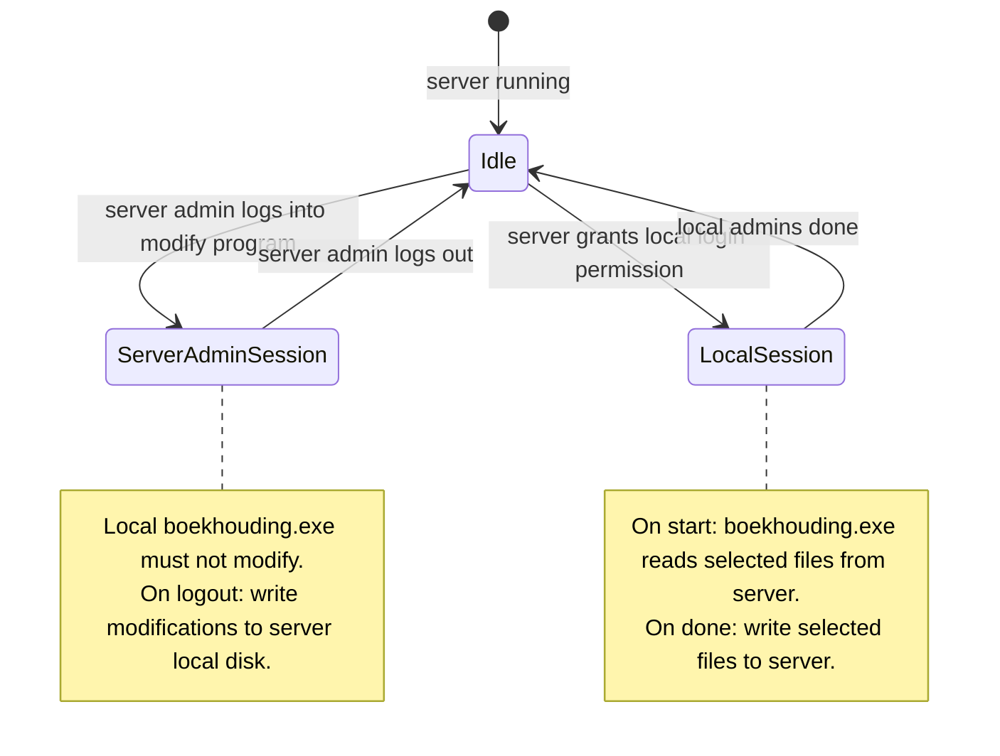
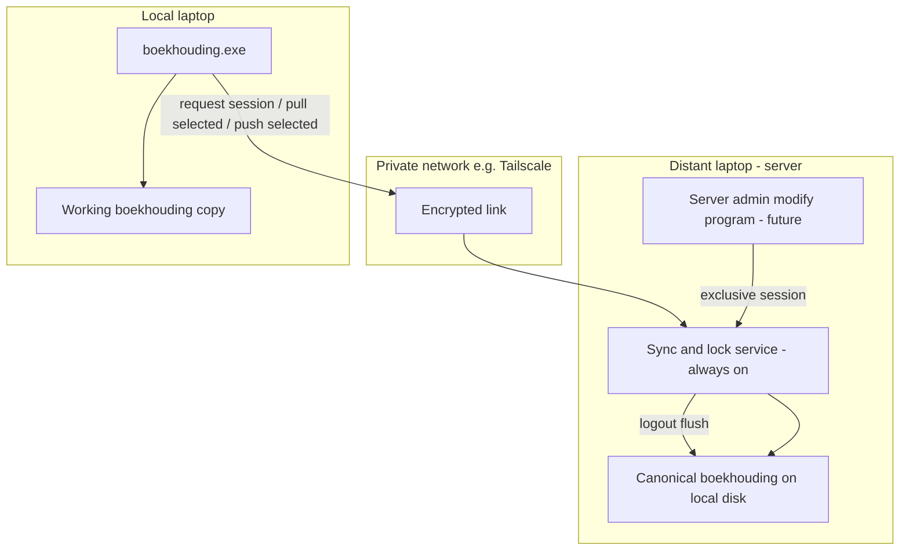

# Server — shared `boekhouding` data between local laptop and distant server

Plan for sharing person packs under `boekhouding/` between:

- **Local laptop** — runs `boekhouding.exe` (multi-person admin). Used by **local administrators**.
- **Distant laptop (“server”)** — runs continually. Hosts the canonical data on disk and a (future) program for the **server administrator** to view/modify data.

This is **not** the existing JSON blob store in [`boekh-server`](../boekh-server/). That service stores flat `storage/<person>/*.json` (mainly consent). Whole person folders (`data/` + `secret/`) need a different sync + locking design.

---

## Roles

| Role | Machine | Program | Rights |
|------|---------|---------|--------|
| Server administrator | Distant laptop (“server”) | Modify program (still to be made) | Exclusive write while logged in |
| Local administrators | Local laptop | `boekhouding.exe` | Read/write only when the server grants a session (server admin must be logged out of the modify program) |

**Invariant:** at most one side may modify shared data at a time. The distant **server** is the authority for that lock and for the on-disk copy of record when the server admin works.

---

## Session / locking rules



1. **Distant server runs continually** (sync/lock service always available when the machine is on).
2. **Whenever the server administrator is logged into the modify program** (still to be made):
   - Local administrators **must not** modify the data (local `boekhouding.exe` is denied write / denied a local session).
3. **Whenever the server administrator logs out** of that program:
   - Pending modifications from that session are **written to the distant server’s local disk**.
4. **Whenever local administrators obtain permission to log in** (granted by the server, and only when the server administrator is **not** in the modify program):
   - Local `boekhouding.exe` **starts by reading selected files from the server** into the local `boekhouding/` tree (or in-memory/working copy).
5. **Whenever local administrators are done modifying**:
   - **Selected files are written back to the server**.
   - The local session ends; the server may grant another session later.

Exact “selected files” list is to be defined in implementation (minimum useful set for the multiperson UI: per person `data/categorized_transactions.json`, `data/category_totals.json`, `data/categories.json`, `data/personal_categories.json`, `data/consent.json`; optionally `secret/` only if the remote side must bank-fetch). Until specified otherwise, treat **selected files** as the JSON under each person’s `data/` that the admin UI needs; keep `.pem` out of the sync path unless explicitly required.

---

## Data layout (both machines)

```text
boekhouding/
  anton_schins/
    data/
    secret/
  eugen_graas/
    …
  juleon_schins/
    …
```

Local `boekhouding.exe` already discovers sibling folders that contain both `data/` and `secret/`. After a granted local session sync-in, the same layout must exist on the local laptop.

---

## What already exists in this repo

| Package | Role | Enough for this plan? |
|---------|------|------------------------|
| [`boekh-server`](../boekh-server/) | Bearer-auth JSON PUT/GET under `storage/<person>/` | No — not whole-folder / not session lock |
| [`boekh-multiperson`](../boekh-multiperson/) | Local multi-person UI over `boekhouding/` | Local UI only; no server lock yet |
| [`shared/server_client`](../shared/shared/server_client/) | JSON client for `boekh-server` | Reusable auth idea; not folder sync |

So you need **new** pieces: a long-running **server** on the distant machine, a **session lock API**, sync of selected files, and a future **server-admin modify program**.

---

## Target architecture



### Distant laptop (“server”) — runs continually

- **Sync + lock service** (new): always listening on the private network.
  - Tracks: `idle` | `server_admin_session` | `local_session`.
  - APIs (conceptual): request/release local session, get lock status, download selected files, upload selected files, (admin) begin/end server-admin session.
- **Server admin modify program** (future): on login acquires `server_admin_session`; on logout persists changes to disk and releases the lock.
- **Canonical disk**: `boekhouding/` person packs on the distant machine.

### Local laptop

- **`boekhouding.exe`** (extend later):
  - Before allowing edits: ask the server for a **local session**.
  - If denied (server admin active, or another local session): show read-only / wait message; do not write.
  - If granted: **pull selected files**, then work normally.
  - On exit / “done”: **push selected files**, release session.

---

## Network and security

- Prefer **Tailscale** (or WireGuard) between the two machines. Do not expose private keys or bookkeeping JSON on the public internet.
- Auth: shared Bearer secret and/or SSH keys dedicated to this sync.
- If `.pem` files are ever synced, treat the channel as highly sensitive; default plan keeps keys off the wire unless you explicitly need bank fetch on both sides.

---

## Implementation outline (later)

1. **Private network** on both PCs; verify reachability.
2. **Distant sync/lock service** (new package under `server/` or similar): continuous process, session state, selected-file pull/push, flush on server-admin logout.
3. **Server admin modify program** (future): exclusive session; write-through to disk on logout.
4. **Extend `boekhouding.exe`**: gate modifications on server-granted session; pull on start of session; push on end.
5. **Define selected files** precisely and document overwrite rules (server wins after server-admin logout; local push wins only inside a granted local session).

### Minimal first slice (before the admin UI exists)

- Distant service always on, lock state machine, pull/push of selected `data/*.json`.
- Manual “grant local session” / “release” for testing.
- Wire `boekhouding.exe` to refuse writes when lock ≠ `local_session`.

---

## Shopping list

1. Tailscale (or equivalent) on local laptop and distant server  
2. Distant: always-on sync/lock service  
3. Distant: server-admin modify program (future)  
4. Local: session-aware `boekhouding.exe` (pull → edit → push)  
5. Shared auth secret  
6. Agreed paths for `boekhouding/` on both machines  
7. Written list of **selected files** to sync  

---

## Out of scope (for now)

- Replacing [`boekh-server`](../boekh-server/) consent JSON API  
- Offline edits with automatic merge/conflict resolution (sessions are exclusive instead)  
- Multi-local-admin concurrent sessions (one local session at a time unless extended later)  
